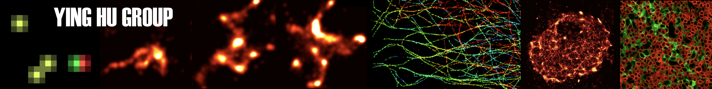

# The-Ying-Hu-Group
[//]: #  
[//]: # Above example of hyperlink image. Below is html style rendering.

  </img>

### Welcome to the Immune Imaging Group at UIC!    
#### Our research develops single-molecule and superresolution bioanalytical techniques to examine interactions of biomolecules in health and disease, with a particular focus on immunity.
# Papers
## [Rapid statistical discrimination of fluorescence images of T cell receptors on immobilizing surfaces with different coating conditions](https://github.com/jesse-anderson/The-Ying-Hu-Group/tree/main/SCAMPI)
